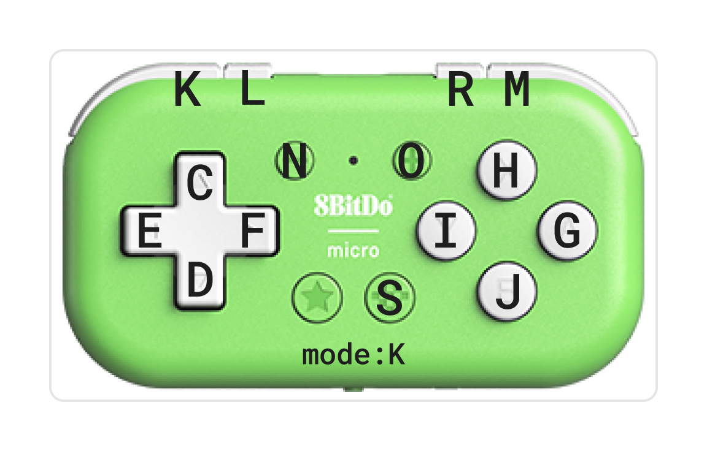

# pibtinput

Python library for bluetooth


## Install

**XXX TBD XXX**

``` bash
sudo apt install evtest
```


## ペアリング

### 順序が重要!: trust -> pair -> connect

``` bash
sudo bluetoothctl

scan on
# MAC_ADDR 確認
scan off
trust MAC_ADDR
pair MAC_ADDR
connect MAC_ADDR
```


### 動作確認

``` bash
ls /dev/input

sudo evtest
:
```


## Bluetooth trouble shooting

以下の手順でだいたい、リセットされる。

``` bash
sudo bluetoothctl
remove MAC_ADDR
exit

sudo hciconfig hci0 down
sudo hciconfig hci0 up
sudo systemctl restart bluetooth.service
```

## 参考

### 8BitDo Micro

Keyboard mode

